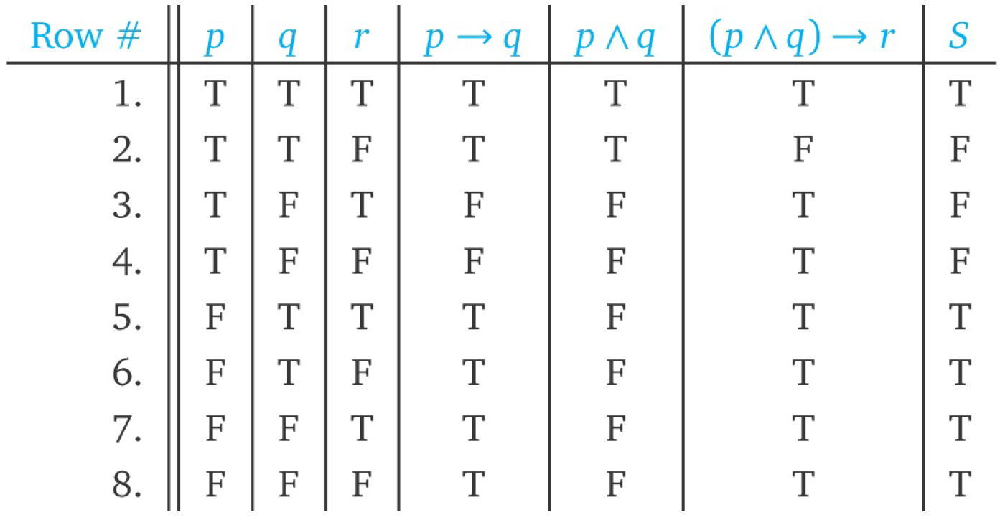

# Formal Logic

A **statement** (also known as a proposition) is a declarative sentence that is either
true or false, but not both.

x is even.

In this case, x is called a free variable. The truth of the sentence depends on the value of x, so if that value is not specified, we can’t regard this sentence as a statement.

A second type of declarative non-statement can happen when a sentence is self-referential:

This sentence is false.

We can’t decide whether or not the above sentence is true. If we say it is true, then it claims to be false; if we say it is false, then it appears to be true.

Often, mathematicians use the word “implies” as a synonym for the → connective. 

“If p then q” means the same thing as “p implies q,” namely that q is a necessary consequence of p.

Note:

Solve the exercises starting from 15.